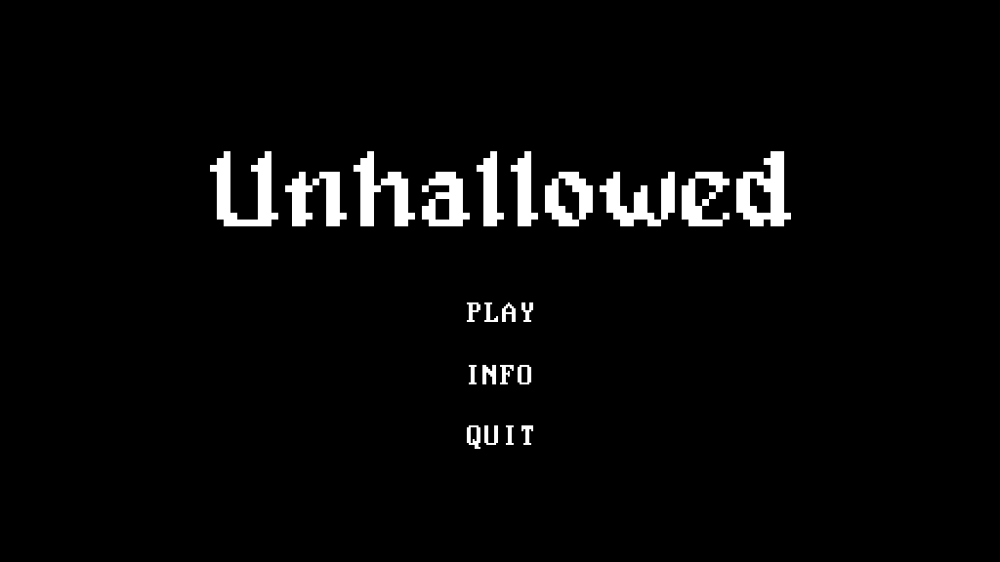
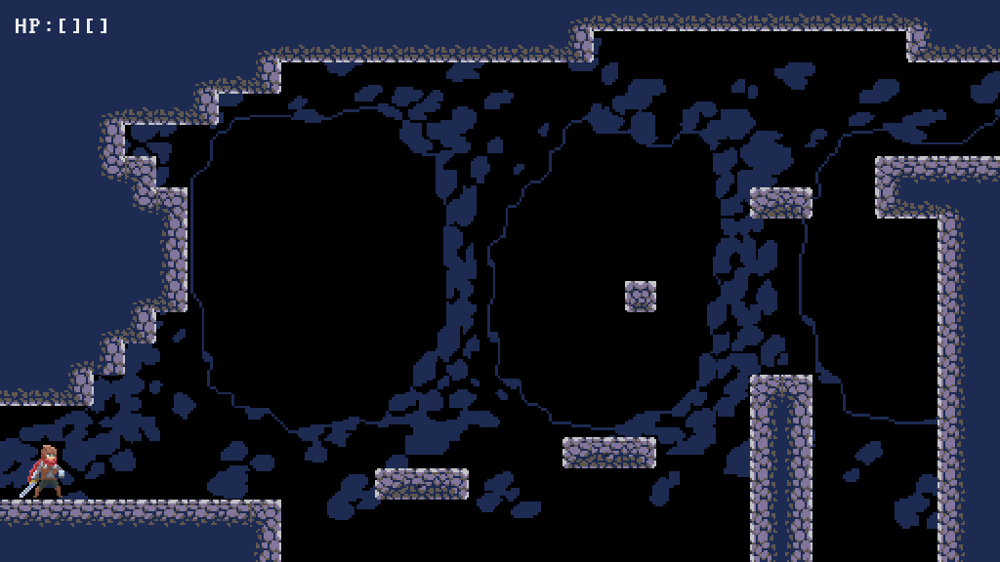

unhallowed
==========

Requires [pygame](https://pypi.org/project/pygame/).

Use the bundled exe or run in your favorite IDE, no judgment here.

Credits
-------
- Based on a tutorial by [Russ](https://www.youtube.com/watch?v=Ongc4EVqRjo)
- Adventurer sprites by [rvros](https://rvros.itch.io/animated-pixel-hero)
- Double jump effect by [Viktor](https://v-ktor.itch.io/pixelated-attackhit-animations)
- Tileset by [Shackhal](https://shackhal.itch.io/multi-platformer-tileset)
- Slime sprites by [rvros](https://rvros.itch.io/pixel-art-animated-slime)
- Title font by [Hewett Tsoi](https://www.dafont.com/alagard.font)
- Main font by [Zeh Fernando](https://www.dafont.com/perfect-dos-vga-437.font)
- Title theme and Ice theme by [xDeviruchi](https://xdeviruchi.itch.io/8-bit-fantasy-adventure-music-pack)
- Cave theme by [Etalify](https://www.youtube.com/watch?v=c9rMlxCwbm0)
